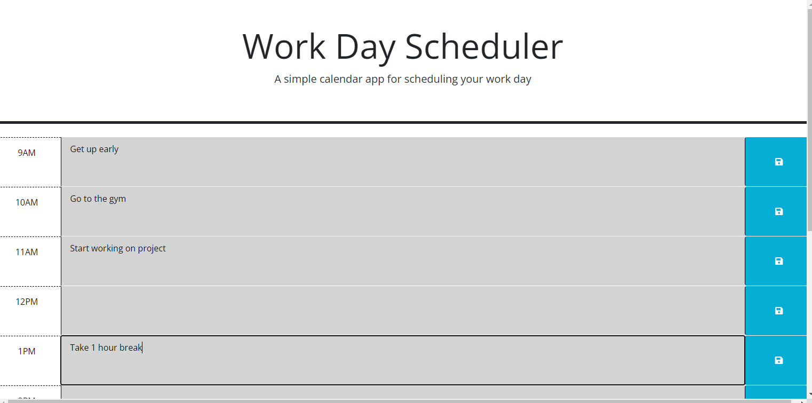

# Work-Schedule

   

  This application is supposed to color code each time block by past, present or future. As well as storing any saved inputs into local store. It is intended to act as a sort of planner.

  ## Table of Contents
  1. [Installation](#installation)
  2. [usage](#usageinfo)
  3. [license](#licenses)
  4. [Contributors](#contribution)
  5. [Tests](#testing)

  ## Installation
  N/A

  ## Usage

  ## License
  MIT

  ## Contributors
  N/A

  ## Tests
  N/A
